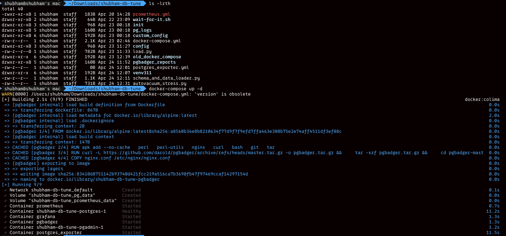
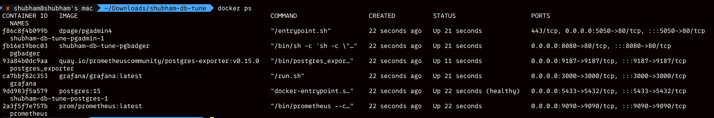
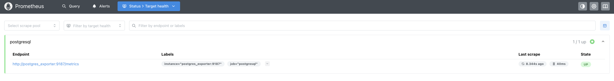
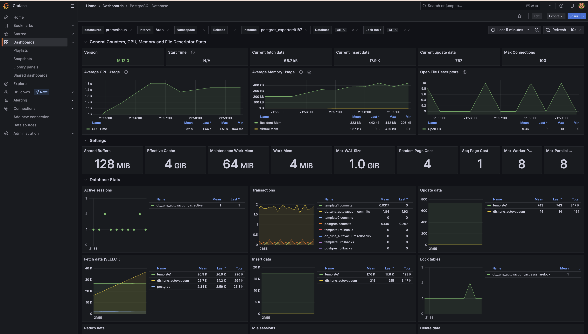
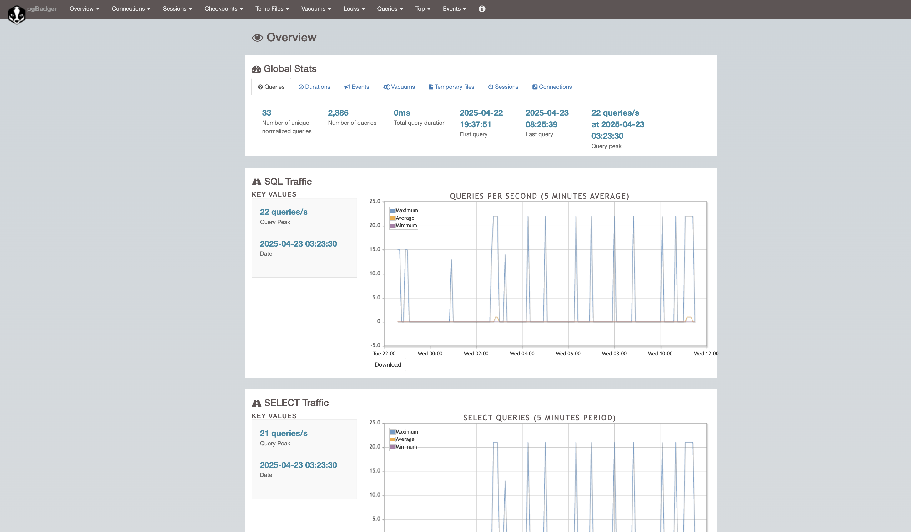
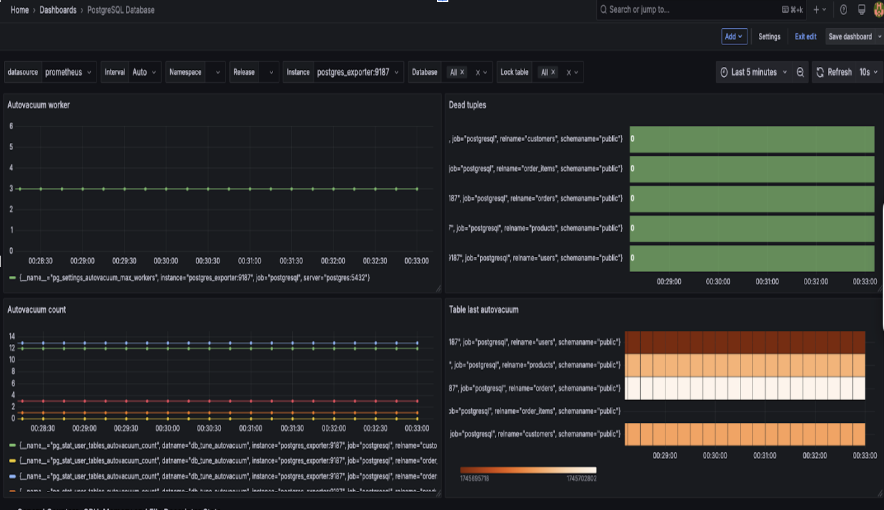
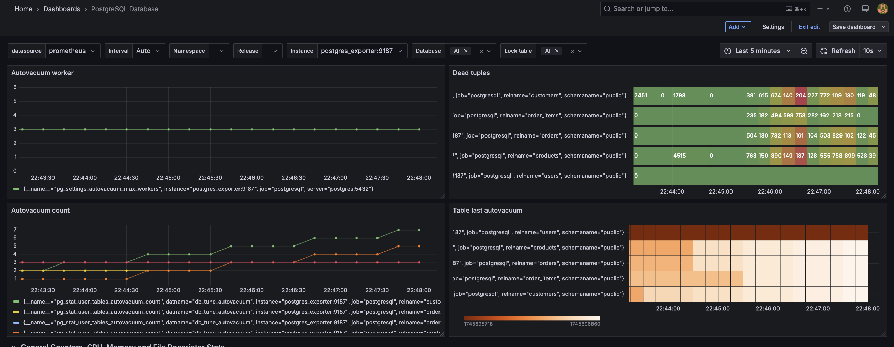
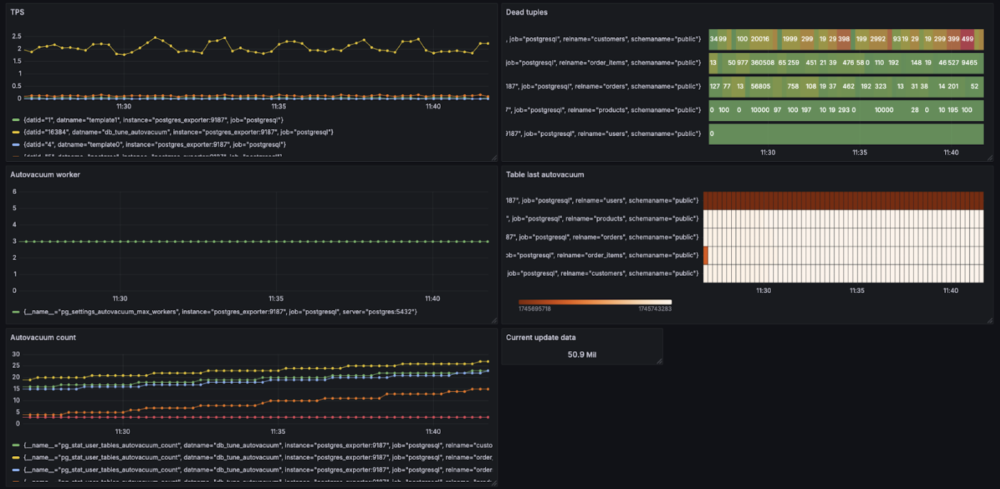

# **PostgreSQL Autovacuum Stress Testing**

⸻
## **Environment Setup**

Deployed and verified the following services using Docker Compose:
	•	PostgreSQL 15 database
	•	Prometheus for metrics collection
	•	Grafana for dashboard visualization
	•	PG Badger for PostgreSQL logs analysis

Docker Compose deployment and services running 

	•	Prometheus for metrics collection

•	Grafana for dashboard visualization

•	PG Badger for PostgreSQL logs analysis

## **Build an automated setup to simulate autovacuum overload in a PostgreSQL database by:**
	•	Creating schema and indexes
	•	Loading mock real-world-like data
	•	Generating dead tuples aggressively
	•	Monitoring and proving autovacuum stress

## **Four autovacuum panels were added to grafana**

## **Tables are created and bulk dummy data was inserted using schema_and_data_loader_4_tables.py:**

## **Stress the Autovacuum Process**

Separate Python script (autovacuum_stress.py) runs:
	•	Full table UPDATEs (customers, orders, order_items, products)
	•	Random 15% DELETEs from orders and order_items each cycle
	•	Continuous workload without significant sleep delays

This generates constant dead tuples faster than default autovacuum settings can clean.

 PostgreSQL autovacuum gets progressively overwhelmed.

## **Signs That Autovacuum Is Failing**

### **Dead tuples continuously growing -**

Autovacuum is not cleaning fast enough, leading to dead tuple buildup.

### **Last autovacuum timestamps are old -**

Tables are not being vacuumed on schedule, indicating autovacuum lag.

### **Transactions Per Second starts dropping -**

Database performance degrades due to bloated tables.

### **CPU usage rises abnormally -**

Autovacuum workers and user queries compete heavily for CPU resources.

### **Disk space usage grows rapidly -**

Dead tuples occupy unreclaimed disk space, risking full disk errors.

## **How to Fix Autovacuum Stress**

When PostgreSQL autovacuum begins to fall behind under heavy workloads, we can apply the following tuning.

### **Live Tuning**

We can dynamically adjust the autovacuum parameters without restarting the database:

ALTER SYSTEM SET autovacuum_vacuum_cost_limit = 5000;
ALTER SYSTEM SET autovacuum_vacuum_cost_delay = 0;
ALTER SYSTEM SET autovacuum_naptime = '10s';
SELECT pg_reload_conf();

### **Effect:**
	•	Allows autovacuum workers to clean dead tuples faster.
	•	Reduces delays between autovacuum operations.
	•	Autovacuum wakes up more frequently (every 10 seconds instead of default 60 seconds).

Takes effect immediately after running pg_reload_conf()

### **Some deeper parameters require a full PostgreSQL server restart to apply:**

ALTER SYSTEM SET autovacuum_max_workers = 10;

### **Effect:**
	•	Increases the number of autovacuum workers.
	•	Allows multiple tables to be cleaned in parallel, greatly improving vacuum throughput.

With these tuning changes, PostgreSQL can catch up with dead tuples, prevent bloat, and maintain TPS performance during high-churn workloads.

⸻
